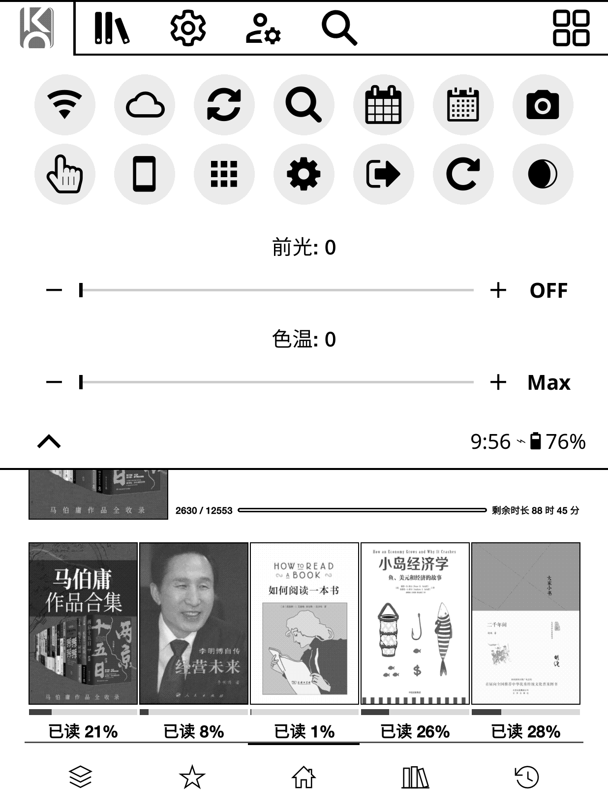
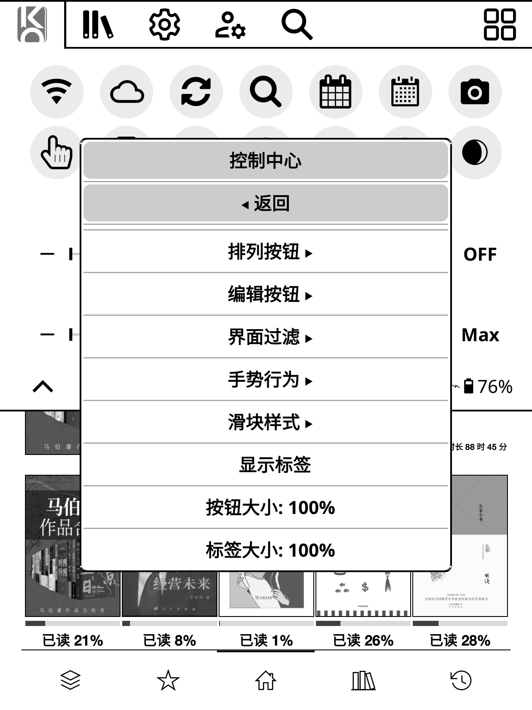
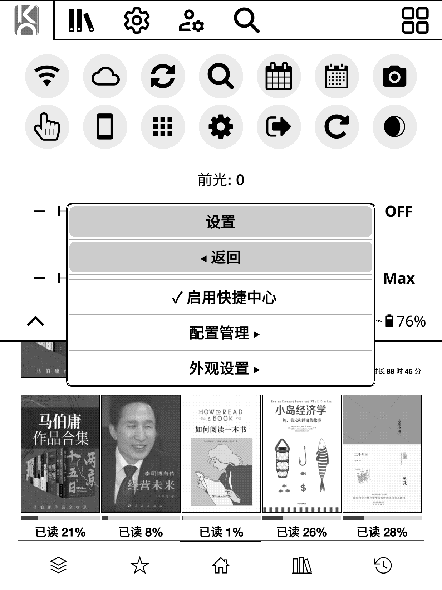

# QuickCenter — KOReader 快捷操作与控制中心补丁

> **QuickCenter：快捷操作 + 控制中心 —— 一个轻量、可自定义、支持手势的快捷中枢，单文件即插即用。**

> **作者**：[Arin-Chin](https://github.com/Arin-Chin) | **许可协议**：AGPL-3.0 | **兼容性**：KOReader（LuaJIT）

---

## 📖 概述

QuickCenter 是一个独立的 KOReader **补丁**（单个 `.lua` 文件，放入 `koreader/patches/` 即可），将两大核心功能合为一体：

| 功能 | 说明 |
| :--- | :--- |
| ⚡ **快捷操作** | 自定义动作：录制、编辑、管理常用操作，通过快捷操作菜单或手势一键运行 |
| 🎛️ **控制中心** | 一键操作面板及其全部按钮设置：布局、形状、滑块、过滤与手势行为 |


> 💡 **灵感来源**：
> - [kopatches](https://github.com/gytwo/kopatches)
> - [quickui.koplugin](https://github.com/gytwo/quickui.koplugin)
> - [simpleui.koplugin](https://github.com/doctorhetfield-cmd/simpleui.koplugin)
> - [KOReader.patches](https://github.com/joshuacant/KOReader.patches)

---

## 🚀 核心功能

### 1. ⚡ 快捷操作

创建、编辑和管理你最常用的操作，通过快捷操作菜单或绑定手势随时运行。

| 功能 | 说明 |
| :--- | :--- |
| **自定义动作** | 5 种类型：文件夹、收藏、插件、系统动作（Dispatcher）、**录制的菜单动作** |
| **菜单录制** | 将任意菜单路径录制为可复用的快捷操作；录制后可在编辑时自定义其界面（视图） |
| **编辑快捷操作** | 新增 / 重命名 / 删除动作；已有自定义操作归入 **已有操作** 子菜单；通过 **添加到快捷操作菜单** 勾选为快捷方式 |
| **快捷操作菜单** | 管理已添加的快捷操作（勾选/取消勾选以移除）；手势可唤出无标题栏的运行列表 |

<table>
  <tr>
    <td></td>
    <td></td>
  </tr>
</table>

<table>
  <tr>
    <td></td>
    <td></td>
  </tr>
</table>

### 2. 🎛️ 控制中心

注入顶部菜单栏首个标签页的可自定义操作面板（文件管理器与阅读器通用），以及它的全部按钮相关设置。

| 设置项 | 选项 / 说明 |
| :--- | :--- |
| **内置动作** | Wi-Fi、夜间模式、旋转、截屏、继续阅读、搜索、重启、退出、电源、HTTP 服务器、字体列表、阅读统计等 |
| **排列按钮** | 在 QuickCenter 样式框中以 ▲ / ▼ 调整面板按钮顺序（灰底标题栏、返回导航） |
| **编辑按钮** | 以复选框方式添加 / 移除面板按钮（QuickCenter 样式框，含返回导航） |
| **按钮布局** | 自动布局（按面板宽度流动排列）或自定义固定网格（**行数 × 每行按钮数**） |
| **界面过滤** | 按上下文显示 / 隐藏动作（文件管理器 / 阅读器 / 通用） |
| **手势行为** | 长按按钮编辑 · 长按面板打开设置 |
| **按钮形状** | 圆形 / 圆角方形 / 无边框 |
| **按钮背景** | 透明 / 实色 / 浅灰 |
| **滑块样式** | 线条 / 分段按钮 |
| **按钮大小** | 60% ~ 150%（步进 5%） |
| **标签大小** | 50% ~ 200%（步进 10%） |
| **显示标签** | 开关 |
| **前光 / 色温滑块** | 支持数值显示与 Min / Max 快捷键 |





### 3. ⚙️ 设置

`工具 → QuickCenter` 打开设置菜单：

| 功能 | 说明 |
| :--- | :--- |
| **启用快捷中心** | 启用 / 停用面板标签页（需重启生效） |
| **配置管理** | 命名预设：**保存配置** · **编辑配置** · **重设配置** |
| **外观设置** | 面板图标 · 系统图标替换 · UI 字体切换 |

#### 配置管理

| 功能 | 说明 |
| :--- | :--- |
| **保存配置** | 将当前配置保存为**命名预设** |
| **编辑配置** | 浏览已保存的预设：**长按以当前配置覆盖**，或进入子菜单进行更新 / 重命名 / 删除 |
| **重设配置** | 恢复出厂默认值 |

> 预设可随时保存、覆盖和恢复——方便在阅读 / 夜间 / 出行等场景间快速切换。




#### 🖼️ 图标选择器

| 来源 | 说明 |
| :--- | :--- |
| **Nerd Font** | 自动扫描符号字体字形，支持码位搜索 |
| **SVG / PNG 文件** | 浏览 `koreader/icons/` 与内置图标目录，支持名称筛选 |
| **系统图标替换** | 替换 KOReader 内置图标（网格预览、批量应用 / 重置） |

#### 🔤 UI 字体切换

从已安装字体中替换 KOReader 的 UI 字体（常规 / 粗体 / 等宽），支持实时预览与一键重置。

---

## 🔧 手势 / 快捷支持

在 KOReader 手势管理中为以下 Dispatcher 动作绑定任意手势：

| 动作标题 | Dispatcher 动作键 | 说明 |
| :--- | :--- | :--- |
| `QuickCenter：控制中心面板` | `quick_actions_panel` | 打开控制中心面板标签页 |
| `QuickCenter：快捷中心设置` | `qa_settings_action` | 打开 QuickCenter 设置 |
| `QuickCenter：快捷操作菜单` | `qa_shortcuts_menu` | 打开快捷操作运行列表（无标题栏） |

> 手势绑定在重启后依然有效——补丁在退出时会刷新设置，确保会话中的绑定被持久化。

---

## 📦 安装

1. 将 `2-quickcenter.lua` 复制到 KOReader 的 `patches` 目录：`koreader/patches/`
2. **移除 patches 目录中旧的 `2-quickactions.lua`**（两者会冲突）
3. *（可选）* 将 `quickcenter.lua` 复制到 `koreader/settings/quickcenter.lua` —— 内含现成设置（自定义动作、按钮覆盖等）。不复制则首次运行自动生成默认配置
4. 重启 KOReader

> **从 `2-quickactions.lua` 升级**：将 `koreader/settings/quickactions.lua` 重命名为 `quickcenter.lua`，即可保留全部自定义动作与设置。

**卸载**：删除补丁文件；如需清理，可同时删除 `koreader/settings/quickcenter.lua`。

---

## 📁 文件结构

```
QuickCenter/
├── 2-quickcenter.lua   # 补丁本体（单文件，即插即用）
├── quickcenter.lua     # 配置文件（可选，放 koreader/settings/）
├── README.md           # 文档（英文）
├── README.zh_CN.md     # 文档（简体中文）
└── pictures/           # 截图
```

| 文件 | 用途 |
| :--- | :--- |
| `2-quickcenter.lua` | 快捷操作 + 控制中心 + 配置管理 + 图标 / 字体工具 |
| `quickcenter.lua` | 现成设置文件 —— 复制到 `koreader/settings/quickcenter.lua` |
| `README.md` | 文档（英文） |
| `README.zh_CN.md` | 文档（简体中文） |

---

## ⚙️ 配置

所有设置保存在 `koreader/settings/quickcenter.lua`（首次运行自动生成）。

主要配置分组：

| 分组 | 键名 | 说明 |
| :--- | :--- | :--- |
| 面板 | `qa_enabled`、`qa_slots`、`qa_*` | 面板开关、按钮顺序、形状、大小、标签、滑块 |
| 布局 | `qa_layout_*` | 自定义按钮网格（开关 / 行数 / 每行数） |
| 快捷方式 | `qa_shortcuts` | 已加入快捷操作菜单的动作 |
| 配置 | `saved_configs` | 命名配置预设 |
| 外观 | `qa_tab_icon`、`qa_icon_overrides`、`ui_font_overrides` | 面板图标、系统图标替换、UI 字体 |

---

## 🔌 兼容性与依赖

| 项目 | 要求 |
| :--- | :--- |
| **KOReader** | 任意较新构建（LuaJIT）；已在 v2026.07 验证 |
| **设备** | 前光 / 色温滑块需设备支持 |
| **图标** | Nerd Font 功能需要 Nerd Font 符号字体 |

---

## 📝 更新日志

### 2026-08-24 — Bug 修复：图标选择器缓存回归

修复重构引入的崩溃：`showIconPicker` 的缓存写入误改为数组表，而读取端仍按字段名访问，导致第二次打开图标选择器时 `icons_list` 为 nil，触发 `attempt to get length of local 'display_list' (a nil value)` 崩溃。

- 缓存恢复为字段名字段表，读写一致；读取端增加完整性校验（尺寸 + `icons_list` 存在）
- `getDisplayList` 增加 `icons_list or {}` 防御，杜绝同类回归导致崩溃
- 界面选择对话框（`showViewPickerDialog`）增加 `tap_close_callback`：点击外部 / 实体返回键关闭时同样重建编辑框，避免对话框状态丢失导致返回后界面错乱

### 2026-08-24 — Bug 修复：视图选择器未关闭 + 插件返回崩溃

- `showViewPickerDialog` 中 `local view_dialog` 声明在按钮回调闭包之后，闭包内的 `UIManager:close(view_dialog)` 实际引用全局 nil，对话框从未从窗口栈移除 —— 保存后残留的“选择界面”重新露出。已改为前向声明
- 插件/补丁子菜单的 `showPluginSubMenu` / `showPluginList` 互相引用却无前向声明，点“返回”会调用全局 nil 崩溃。已补前向声明

### 2026-08-24 — Bug 修复：Dispatcher 缓存崩溃

修复“新建操作 → 系统动作”崩溃：`getDispatcherSettingsList` 曾把缓存挂在函数名上（`getDispatcherSettingsList._cache`），LuaJIT 不支持对函数值索引，报 `attempt to index upvalue ... (a function value)`。已改为独立局部变量缓存。

---

## 📝 更新日志（重构记录）

### 2026-08-24 — 深度重构与优化

单文件补丁全面重构：体积更小、更健壮、墨水屏运行更流畅。**无功能与配置格式变更** —— 现有 `koreader/settings/quickcenter.lua` 可直接沿用。

- **体积** — `2-quickcenter.lua` 从约 314 KB / 8189 行减至约 260 KB / 5739 行（−17%）：清除死代码（未使用的 require、`_batch_depth`、未调用的 `PluginScan.exists`），合并重复实现（动作执行器、菜单字体补丁、动作列表构建、重启确认框），提取公共辅助函数（`menuSubTable`、`findMenuItem`、`askRestart`、`moveSlot`、`showViewPickerDialog` 等）
- **性能** — Dispatcher 设置表（`settingsList`）由每次按动作重复扫描改为解析一次并缓存（O(n²) → O(n)）；Nerd Font 字形扫描仅查找一次 symbols 字体面（约 900 → 1 次查找）；滑块按钮高度惰性测量，不再每次构建面板时创建测量用控件
- **健壮性** — 修复 3 处潜在 bug：`clearFileIconsCache` 清空的是错误的（全局）缓存表、`TOUCHMENU_STUB` 在声明前被引用（解析为全局 nil）、`replayPath` / `_stopPicking` / `injectPanelTab` 在 `local` 声明之前被闭包调用；动作执行包裹 `pcall`，单个动作异常不会导致 KOReader 崩溃
- **可维护性** — 顶层局部变量从 202 降至 195（安全低于 Lua 200 槽上限）；统一命名、简化深嵌套、关键逻辑补充中文注释

---

## 📄 许可协议

本项目基于 **GNU Affero General Public License v3.0（AGPL-3.0）** 发布。

详见：[https://www.gnu.org/licenses/agpl-3.0.zh.html](https://www.gnu.org/licenses/agpl-3.0.zh.html)
